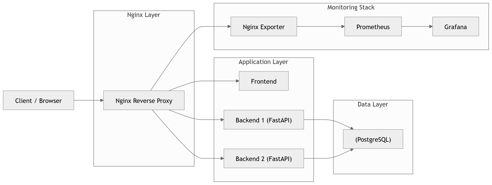

## NGINX как Reverse Proxy, Load Balancer, API Gateway.

### Архитектура

#### Основные реализованные настройки NGINX:
1. *Reverse proxy* / на фронтенд, /api/ на бэкенд
2. *Load Balancer* между двумя инстансами бэкенда (RoundRobin)
3. **HTTPS** (самоподписанные сертификаты OpenSSL)
4. Редирект с HTTP на HTTPS
5. *Rate limiting* запросов к бэкенду
6. Проработано логирование: access.log(кастомный формат записи логов), error.log
7. Хэдеры для защиты от XSS, Same origin policy

### **Мониторинг**
- Prometheus (сбор метрик)
- nginx-prometheus-exporter 
- Grafana (визуализация)

Создан кастомный дашборд с основными метриками:
1. Активные соединения
2. Соединения в состоянии reading / writing / waiting 
3. Общее количество запросов
4. RPS
5. Состояние инстанса (up/down)

Стек мониторинга выведен в отдельный docker-compose, объединён с основным через docker networks. Это делает стек мониторинга легко настраиваемым и применимым с другими системами.

### Дашборд
